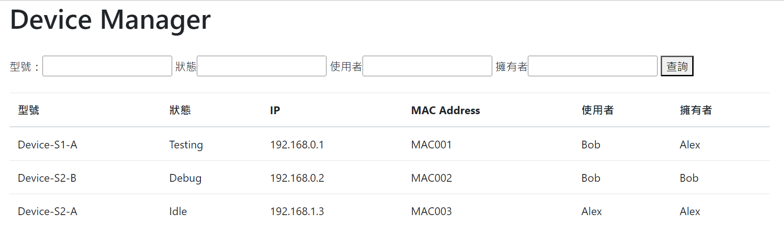
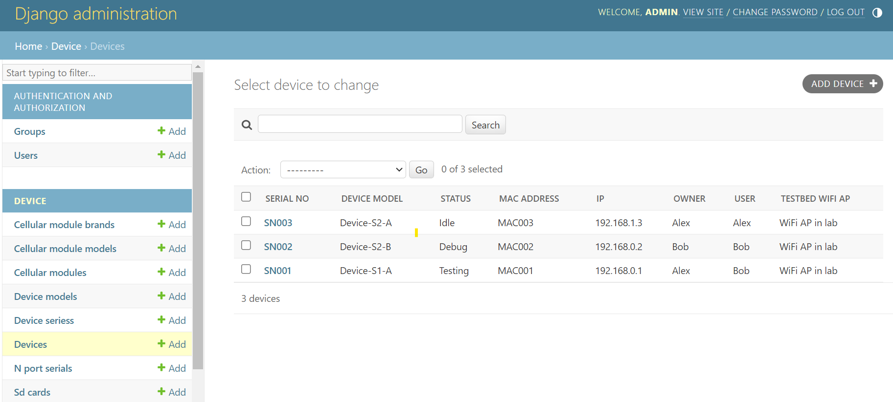

# Device Manager

Provide a platform to manage information about testing device and its status.

## How to use

1. Install docker & docker-compose.
2. Clone this code.
3. start running the Device Manager.
    ```
    docker-compose up -d
    ```

## Features
### Homepage
The homepage offers a quick overview of device information and provides a search function.


### Admin
Provide admin page to manage devices.


### API
Retrieve or update device information by restful API.

1. Get all device information.
    ``` 
    GET http://localhost/api/device 
    ```
2. Get device information using the serial number.
    ```
    GET http://localhost/api/device/{serial no}
    ```
3. Update device information using the serial number.
    ```
    PATCH http://localhost/api/device/{serial no}
    ```
